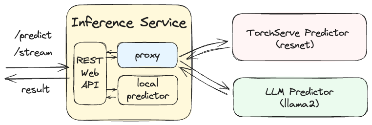

# llm-model-serving
The lab repo for the video course: "LLM Model Serving in Action", 

*Notes: Please instal the [Git Large File Storage](https://docs.github.com/en/repositories/working-with-files/managing-large-files/installing-git-large-file-storage) (such as `brew install git-lfs` for mac) before clone the repo. This is because this repo contains some large model files (200MB+).*

## Lab Architecture 
We developed this lab to provide a practical, hands-on introduction to the fundamentals of model serving. Our goal is for you to understand the basic principles, which will help make sense of the more complex model serving frameworks and solutions used in real-world applications once you grasp these foundational concepts.

In this lab, we demonstrate the general serving paradigm — proxy and predictors — through three services: **inference service**, **torchserve predictor**, and **llm predictor**.

The [Inference service](./serving/README.md) acts as the public interface, handling all model serving requests. Depending on the type of request, it either processes it locally or forwards it to the appropriate backend predictor.

The [TorchServe predictor](./predictor/torchserve/README.md) exemplifies the integration of an existing solution, PyTorch serving, into our infrastructure, showcasing its application within our setup.

The [LLM Predictor](./predictor/llm/README.md) provides an example of a custom-developed predictor. It hosts a llama model that operates without the need for a GPU. Additionally, it offers two APIs: one for streaming and another for predictive request.

To run the lab locally, please follow the [deployment](./images/README.md) instruction.

## Project Overview
* [labs](./labs/): hands-on lab materials for the course.
* [deployment](./images/README.md): instructions (on docker compose) to run the backend model serving service locally, this is required for the labs. 
* [serving](./serving/README.md): model inference service, a Python Flask based RESTful service, hosts all the public model inference API. This service also works as a web proxy which route the prediction requests to different predictors behind. 
* [precitor](./predictor/): different types of model predictors, such as [TorchServe](./predictor/torchserve/README.md) and self-developed predictors - [llm predictor](./predictor/llm/README.md). Each of the predictor represents a different way of serving models.
* [.github](./.github/BuildInstruction.md): CI/CD files, the configured github workflow will create new release, build docker image and push to dockerhub automatically. 

