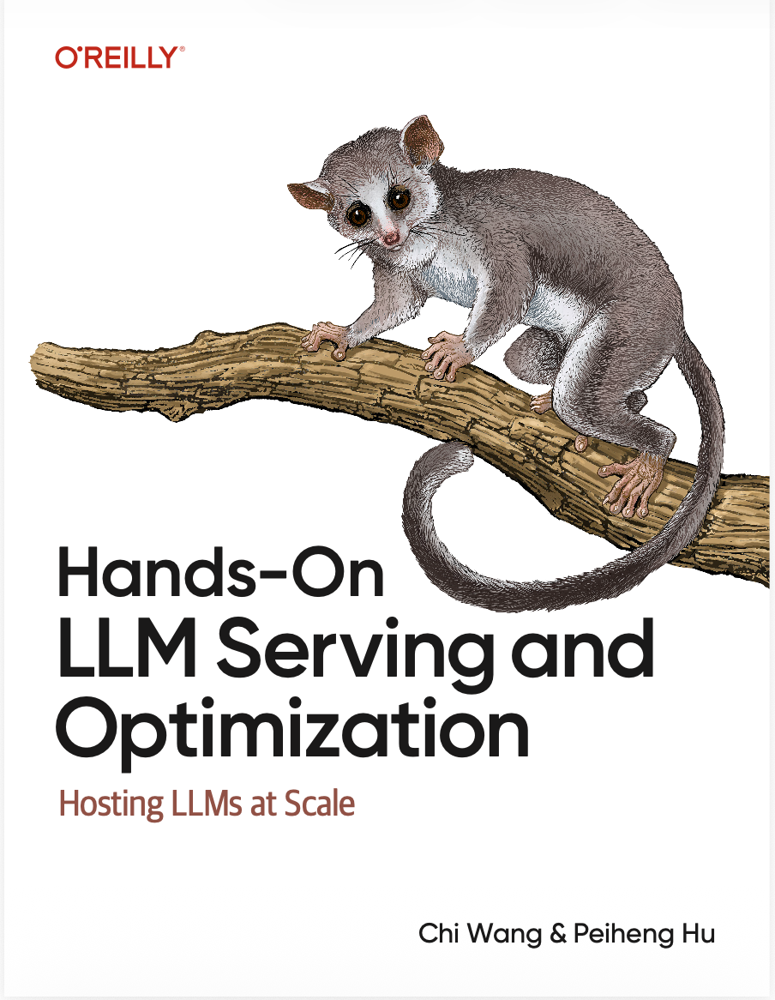

# Hands-On LLM Serving and Optimization

### Hosting LLMs at Scale

**By [Chi Wang](https://www.linkedin.com/in/chi-wang-07b24730/) and [Peiheng Hu](https://www.linkedin.com/in/peihenghu/)** · Published by O'Reilly

<a href="https://www.oreilly.com/library/view/hands-on-llm-serving/9798341621480/">
  
</a>

🌐 **[Book Website](https://orca3.github.io/llm-model-inference/)** · 📘 **[Read on O'Reilly](https://www.oreilly.com/library/view/hands-on-llm-serving/9798341621480/)** · 🛒 **[Buy on Amazon](https://www.amazon.com/Hands-LLM-Serving-Optimization-Hosting/dp/B0G48JRRMF)**

This repository contains the companion source code, notebooks, and examples for the book.

---

## About the Book

Large language models (LLMs) are the reasoning engines of modern AI. Today, a major
inflection point has arrived: as the world races to deploy AI at scale, model inference
has moved to the center of the stack. Welcome to the **inference era**.

Without proper optimization, however, LLMs can be expensive and slow to serve.
*Hands-On LLM Serving and Optimization* is a comprehensive guide to the complexities of
deploying and optimizing LLMs at scale.

In this hands-on, engineering-focused book, authors **Chi Wang** and **Peiheng Hu**
combine practical examples, code, and strategies for building robust, performant, and
cost-efficient AI token factories. Whether you're building the LLM inference
infrastructure or the applications that consume it, a deep understanding of LLM serving
will make you a more effective, future-ready engineer as AI transforms how we work and
build.

With this book, you will:

- **Learn the foundations of model serving** with core concepts, design paradigms, and
  industry best practices.
- **Understand the common challenges** of hosting LLMs at scale.
- **Balance latency and throughput** to meet the demands of AI applications and business
  requirements.
- **Host LLMs cost-effectively** with practical, code-backed techniques.

---

## Repository Layout

The code is organized by book chapter. Chapters 1 and 5 are conceptual and have no
accompanying code.

| Chapter | Topic | Contents |
| --- | --- | --- |
| [`ch02/`](ch02) | **Large Language Model Serving** | Notebooks walking through transformer internals, step-by-step LLM execution and the KV cache, running Qwen with vLLM, plus streaming and batching basics. |
| [`ch03/`](ch03) | **Model-Serving System Design** | A from-scratch [single-model LLM serving service](ch03/single_model_llm_serving) (batching, streaming, vLLM backend) and a [multi-model serving service](ch03/multi_model_serving) including an NVIDIA Triton example. |
| [`ch04/`](ch04) | **Model Serving Best Practices** | A sample [Knowledge Agent](ch04/KnowledgeAgent) (RAG + planning) and cloud deployment examples on AWS — [Bedrock](ch04/bedrock), [JumpStart](ch04/jumpstart), and [Deep Learning Containers](ch04/dlc) with [customization](ch04/dlc_customization). |
| [`ch06/`](ch06) | **Essential LLM Optimization Techniques** | A [quantization](ch06/quantization_3way_300.ipynb) walkthrough comparing precision/throughput trade-offs. |
| [`ch07/`](ch07) | **Advanced LLM Optimization Techniques** | Hands-on [speculative decoding](ch07/SpecDecode.ipynb) and [LMCache](ch07/LMCache.ipynb) (advanced KV caching) examples. |
| [`ch08/`](ch08) | **LLM Serving Frameworks** | Framework notebooks for [SGLang](ch08/SGLang.ipynb), [TensorRT-LLM](ch08/TensorRT_LLM.ipynb), and [llama.cpp](ch08/llamaCpp.ipynb). |
| [`ch09/`](ch09) | **LLM Optimization in Practice** | An end-to-end [optimization plan](ch09/model_optimization_in_practice.ipynb) benchmarking Qwen3-14B with vLLM — quantization, distributed serving, and trade-off analysis, with sample workloads. |

---

## Book Contents

The following is the chapter-by-chapter outline of the book *Hands-On LLM Serving and
Optimization*:

- **Chapter 1 — Introduction to Model Serving and Optimization:** Anatomy of a model, the
  model lifecycle, what model serving is and why we optimize it, serving paradigms (edge,
  single-model, multi-model), and serving platforms.
- **Chapter 2 — Large Language Model Serving:** Inside the transformer, autoregressive
  generation, decoder-only architecture, attention, the KV cache, prefill and decode, and
  running LLMs with a serving framework (vLLM).
- **Chapter 3 — Model-Serving System Design: A Deep Dive:** Building online single-model
  and multi-model serving services from scratch, batching and streaming, NVIDIA Triton,
  and cost- vs. latency-optimized designs.
- **Chapter 4 — Model Serving Best Practices:** Serving in an agentic world (agents, RAG,
  CAG), enterprise serving architecture, building with an open source stack or a cloud
  vendor, build-or-buy strategy, and performance measurement.
- **Chapter 5 — Challenges When Serving LLMs:** Why optimization matters, accelerator
  chips and GPU specs, model-loading bottlenecks, KV cache sizing, and arithmetic-intensity
  analysis of prefill and decode.
- **Chapter 6 — Essential LLM Optimization Techniques:** Request batching and scheduling
  (dynamic, continuous, chunked prefill), scalable attention and kernel fusion, model
  compression (quantization, distillation, pruning), and prefix caching / RadixAttention.
- **Chapter 7 — Advanced LLM Optimization Techniques:** Speculative decoding, multi-GPU
  and multinode inference (data/tensor/pipeline/expert parallelism), prefill–decode
  disaggregation, and advanced KV caching for long-context serving.
- **Chapter 8 — LLM Serving Frameworks:** vLLM internals (architecture, scheduler, layered
  optimization), TensorRT-LLM, SGLang, llama.cpp, and how to select the right framework.
- **Chapter 9 — LLM Optimization in Practice:** A step-by-step optimization plan for
  Qwen3-14B with vLLM, from hardware inspection and benchmarking to quantization,
  distributed serving, and common trade-offs.
- **Chapter 10 — Advancements in LLM Serving:** Semantic caching, performance profiling,
  multimodal serving, edge AI, multi-LoRA serving, and model serving in reinforcement
  learning.

---

## Getting Started

> ⚡ **GPU recommended.** Many of the notebooks and examples (vLLM, TensorRT-LLM,
> speculative decoding, distributed serving, quantization, etc.) require an NVIDIA GPU to
> run. If you don't have local GPU access, we recommend **[Google Colab](https://colab.research.google.com/)**,
> which offers great GPU support on a convenient pay-as-you-go basis — just upload a
> notebook, select a GPU runtime, and go.

Most chapters are self-contained. Each code directory includes its own `requirements.txt`
and/or `README.md` with setup and run instructions. A typical workflow:

```bash
# Clone the repo
git clone https://github.com/orca3/llm-model-inference.git
cd llm-model-inference

# For a given example, create an environment and install its dependencies, e.g.:
cd ch03/single_model_llm_serving
python -m venv venv && source venv/bin/activate
pip install -r requirements.txt
```

Notebooks (`.ipynb`) can be opened with Jupyter, VS Code, or
[Google Colab](https://colab.research.google.com/). GPU-dependent examples
(vLLM, TensorRT-LLM, distributed serving) are best run on machines with NVIDIA GPUs, or on
Colab with a GPU runtime selected.

> **Note:** Model weights and other large artifacts are tracked via Git LFS
> (see [`.gitattributes`](.gitattributes)) and may need to be pulled separately.

---

## Authors

- **[Chi Wang](https://www.linkedin.com/in/chi-wang-07b24730/)**
- **[Peiheng Hu](https://www.linkedin.com/in/peihenghu/)**

---

## License

The code in this repository accompanies *Hands-On LLM Serving and Optimization* (O'Reilly).
Please refer to the book for full context and explanation of each example.
